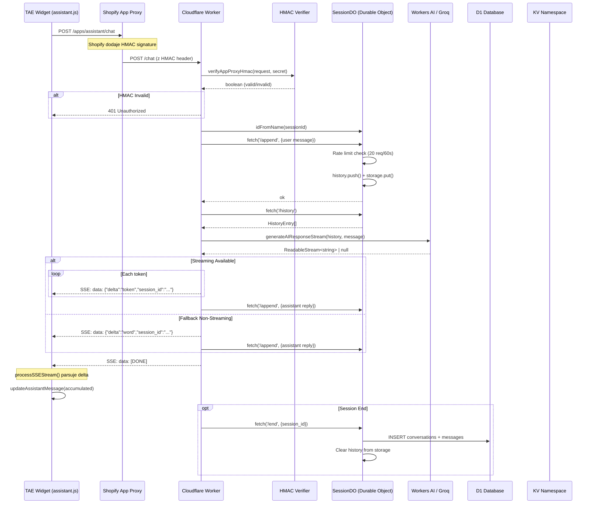

# EPIR-ART-JEWELLERY AI Assistant - Analiza Architektury Production-Ready

## 1. Podsumowanie Struktury Repo

### Komponenty Kluczowe

#### Frontend (Theme App Extension)
- **Lokalizacja**: `extensions/asystent-klienta/`
- **Główny plik**: `assets/assistant.js` (198 linii)
- **UI**: `blocks/assistant.liquid` - widget czatu z konfiguracją Liquid
- **Typy**: `MessageElement`, `StreamPayload` (content/delta/session_id/error/done)

#### Backend (Cloudflare Worker)
- **Lokalizacja**: `worker/src/`
- **Główny plik**: `index.ts` (449 linii)
- **Autoryzacja**: `auth.ts` (83 linii) - HMAC SHA-256 verification
- **Baza danych**: `schema.sql` - D1 (conversations + messages)
- **Testy**: `test/auth.test.ts` - Vitest (6 testów, ✓ pass)

### Flow Diagram (Mermaid)



## 2. Inspekcja Plików - Typy TS i Funkcje

### `worker/src/index.ts`

#### Interfejsy TypeScript:
```typescript
type ChatRole = 'user' | 'assistant';

interface HistoryEntry {
  role: ChatRole;
  content: string;
  ts: number;
}

interface ChatRequestBody {
  message: string;
  session_id?: string;
  stream?: boolean;
}

interface StreamPayload {
  content?: string;
  delta?: string;
  session_id?: string;
  error?: string;
  done?: boolean;
}
```

#### Funkcje Kluczowe:

1. **handleChat()** (lines 294-331)
   - Parsuje `ChatRequestBody`
   - Tworzy/pobiera sessionId
   - Append user message do DO
   - Routing: streaming vs non-streaming

2. **streamAssistantResponse()** (lines 333-413)
   - TransformStream dla SSE
   - Próbuje `generateAIResponseStream()` (real streaming)
   - Fallback: split reply na części (słowa)
   - Format: `data: {"delta":"...","session_id":"..."}\\n\\n`
   - Final: `data: [DONE]\\n\\n`

3. **generateAIResponse()** (lines 217-248)
   - Workers AI binding (`@cf/meta/llama-3.1-8b-instruct`)
   - System prompt: "Jesteś pomocnym asystentem sklepu jubilerskiego EPIR..."
   - Max 10 ostatnich wiadomości z historii
   - Fallback: `"Echo: {message}"` jeśli brak AI

4. **SessionDO class** (lines 115-215)
   - Durable Object dla zarządzania sesjami
   - Rate limiting: 20 req/60s (lines 169-178)
   - `/history` - GET history
   - `/append` - POST add message
   - `/end` - POST flush do D1

### `worker/src/auth.ts`

#### verifyAppProxyHmac() (lines 5-67)
- **Header-based HMAC** (preferred):
  - Canonical: `sorted_params\\n{body}`
  - crypto.subtle.sign('HMAC', key, canonical)
  - Base64 encode + constant-time compare
- **Query param fallback** (hex):
  - Canonical: `k1=v1k2=v2...` (sorted, no separators)
  - crypto.subtle.verify('HMAC', key, signature, message)
- **Constant-time compare** (lines 69-73): XOR-based, prevents timing attacks ✓

### `extensions/asystent-klienta/assets/assistant.js`

#### processSSEStream() (lines 68-151)
- ReadableStream reader
- Buffer parsing: split by `\\n\\n`
- Multi-line data: collect all `data:` lines
- JSON parse: StreamPayload
- **Delta accumulation**: `accumulated += parsed.delta`
- **Content replacement**: `accumulated = parsed.content`
- Error handling: throw on `parsed.error`

#### sendMessageToWorker() (lines 153-224)
- fetch POST to endpoint
- Headers: `Accept: text/event-stream, application/json`
- Body: `{message, session_id, stream: true}`
- AbortController for cancellation
- Fallback JSON if no SSE

## 3. Weryfikacja Integracji

### Flow Testowy (Manual):

1. **TAE → Worker**:
   - UI: `createAssistantMessage()` → loading state
   - Fetch: `/apps/assistant/chat` (App Proxy path)
   - Shopify dodaje HMAC w query/header

2. **HMAC First**:
   - Worker: `verifyAppProxyHmac(request, env.SHOPIFY_APP_SECRET)`
   - DEV bypass: `env.DEV_BYPASS='1' + header x-dev-bypass:1`

3. **DO Session**:
   - `env.SESSION_DO.idFromName(sessionId)` - deterministic DO
   - Append user msg → rate limit → storage

4. **RAG Pipeline** (TODO - brakuje implementacji!):
   - ❌ Brak Vectorize query w kodzie
   - ❌ Brak searchShopPoliciesAndFaqs()
   - ⚠️ Tylko AI binding bez RAG context

5. **SSE Streaming**:
   - Worker: `streamAssistantResponse()` → SSE format
   - UI: `processSSEStream()` → `updateAssistantMessage()`
   - Finalize: `finalizeAssistantMessage()` (remove typing indicator)

6. **Polish Errors**:
   - ✓ "Serwer zwrócił błąd ({status})"
   - ✓ "Nieprawidłowa odpowiedź serwera"
   - ✓ "Przepraszam, wystąpił błąd. Spróbuj ponownie."

### Bindingi (wrangler.toml):

```toml
[durable_objects]
bindings = [{ name = "SESSION_DO", class_name = "SessionDO" }]

[[d1_databases]]
binding = "DB"
database_id = "6a4f7cbb-3c1c-42c7-9d79-4ef74d421f23"

[[kv_namespaces]]
binding = "SESSIONS_KV"
id = "08f16276a9b14ca7b3c00404e8e8d0d9"

[[vectorize]]
binding = "VECTOR_INDEX"
index_name = "autorag-epir-chatbot-rag"

[ai]
binding = "AI"
```

**Status**: ✓ Wszystkie bindingi skonfigurowane, ale Vectorize nie jest używany w kodzie!

## 4. Tabela Oceny - Plusy i Braki per Plik

| Plik | Plusy ✓ | Braki ❌ | Ocena |
|------|---------|----------|-------|
| **worker/src/index.ts** | • Solidna struktura SessionDO<br>• Rate limiting (20/60s)<br>• SSE streaming fallback<br>• Type-safe interfaces<br>• D1 flush on session end | • **Brak RAG**: Vectorize query nie jest implementowane<br>• **Brak Groq**: Tylko Workers AI<br>• **Brak webhook enqueue** (Queue commented out)<br>• **Brak context fallback** przy braku AI<br>• Prompt generic, nie luksusowy | **7/10** |
| **worker/src/auth.ts** | • Constant-time compare ✓<br>• Header + query fallback<br>• crypto.subtle (secure)<br>• Error handling | • Brak retry logic<br>• No logging dla debug | **9/10** |
| **extensions/.../assistant.js** | • Robust SSE parser<br>• Delta + content support<br>• AbortController<br>• Polish errors<br>• Accessibility (ARIA) | • Brak retry na network fail<br>• Brak optimistic UI<br>• Brak typing indicator during stream | **8/10** |
| **worker/schema.sql** | • Clean schema<br>• Foreign key constraint<br>• Index on session_id | • Brak timestamp defaults<br>• Brak metadata columns (user_id, shop_id) | **8/10** |
| **CI (.github/workflows/ci.yml)** | • Type check + tests<br>• Manual deploy<br>• Multi-job (frontend/backend) | • **Brak auto deploy** on tag<br>• Brak E2E tests<br>• Brak lint (ESLint) | **6/10** |

## 5. Identyfikacja Edge Cases i Błędów

### Bezpieczeństwo:
- ✓ HMAC constant-time verify
- ✓ No secrets in code (env vars)
- ❌ Brak CSP headers
- ❌ Brak input sanitization (XSS risk w content)

### Skalowalność:
- ✓ DO sessions (global distributed)
- ✓ Rate limiting per session
- ❌ **Queue dla webhooków** (commented out) - brak async processing
- ❌ Brak circuit breaker dla AI failures

### UX:
- ✓ Polish error messages
- ✓ Streaming UX (deltas)
- ❌ Brak retry button
- ❌ Brak "typing..." indicator realtime

## 6. Next Steps - Implementacja Brakujących Komponentów

### A. RAG Implementation (Priority 1)
**Plik**: `worker/src/rag.ts` (nowy)

```typescript
// Przykładowa struktura:
interface RagContext {
  query: string;
  results: Array<{id: string; text: string; score: number}>;
}

async function searchShopPoliciesAndFaqs(
  query: string, 
  vectorIndex: VectorizeIndex
): Promise<RagContext> {
  // Vectorize query with topK=3
  // Format context for LLM
}
```

### B. Groq LLM Integration (Priority 1)
**Plik**: `worker/src/groq.ts` (nowy)

```typescript
// Streaming Groq API
async function streamGroqResponse(
  messages: Message[], 
  apiKey: string
): Promise<ReadableStream<string>>
```

**Luksusowy Polish Prompt** (z `prompts/groq_system_prompt.txt`):
```
Jesteś eleganckim, wyrafinowanym doradcą marki EPIR-ART-JEWELLERY...
- Używaj tylko materiałów z retrieved_docs
- Cytuj źródło [doc_id]
- Max 2-4 zdania, kulturalnie i zwięźle
```

### C. Populate Vectorize Script (Priority 2)
**Plik**: `scripts/populate-vectorize.ts`

```typescript
// Fetch shop data (products, FAQs, policies)
// Generate embeddings
// Bulk insert to Vectorize
```

### D. Rozbudowa CI/CD (Priority 2)
**Plik**: `.github/workflows/deploy.yml` (nowy)

```yaml
on:
  push:
    tags: ['v*']
jobs:
  deploy:
    - run: npm run test
    - run: npx wrangler deploy
    - run: shopify app deploy
```

### E. E2E Tests (Priority 3)
**Plik**: `tests/e2e/streaming.test.ts` (nowy)

- Test HMAC verification
- Test SSE stream parsing
- Test session persistence
- Playwright dla UI

## 7. Architektura Docelowa (Po Implementacji)

```
┌─────────────────────────────────────────────────────────┐
│                   Shopify Storefront                    │
│  ┌──────────────────────────────────────────────────┐   │
│  │  Theme App Extension (assistant.liquid + .js)    │   │
│  │  • User input                                     │   │
│  │  • SSE stream display                            │   │
│  │  • Polish error handling                         │   │
│  └──────────────────────────────────────────────────┘   │
└─────────────────────────────────────────────────────────┘
                          │ HTTPS POST
                          │ /apps/assistant/chat
                          ▼
┌─────────────────────────────────────────────────────────┐
│              Shopify App Proxy (HMAC inject)            │
└─────────────────────────────────────────────────────────┘
                          │
                          ▼
┌─────────────────────────────────────────────────────────┐
│          Cloudflare Worker (index.ts)                   │
│  ┌──────────────────────────────────────────────────┐   │
│  │  1. HMAC Verify (auth.ts - constant-time)       │   │
│  │  2. Rate Limit Check                             │   │
│  │  3. Session DO (append user msg)                 │   │
│  │  4. RAG Query (Vectorize topK=3)  ← TODO        │   │
│  │  5. Groq LLM Stream (luksusowy prompt) ← TODO   │   │
│  │  6. SSE Response (delta streaming)               │   │
│  │  7. Session DO (append assistant msg)            │   │
│  │  8. Optional: Queue webhook enqueue ← TODO       │   │
│  └──────────────────────────────────────────────────┘   │
└─────────────────────────────────────────────────────────┘
           │              │              │
           ▼              ▼              ▼
    ┌──────────┐   ┌──────────┐   ┌──────────────┐
    │    DO    │   │ Vectorize│   │  D1 Database │
    │ Sessions │   │   RAG    │   │ (archive)    │
    └──────────┘   └──────────┘   └──────────────┘
```

## 8. Podsumowanie i Rekomendacje

### Co Działa Świetnie ✓
1. **HMAC Security**: Constant-time verify, no timing attacks
2. **Streaming Architecture**: Robust SSE parser, fallback handling
3. **Session Management**: DO-based, rate limited, persistent to D1
4. **Type Safety**: TypeScript interfaces, validation functions
5. **Polish UX**: Kulturalne błędy, accessibility (ARIA)

### Krytyczne Braki ❌
1. **RAG Pipeline**: Vectorize binding istnieje, ale zero query logic
2. **Groq Integration**: Brak, tylko Workers AI (generic prompt)
3. **Webhook Queue**: Commented out, brak async processing
4. **E2E Tests**: Tylko unit testy (auth), brak integration
5. **Deploy Automation**: Manual only, brak CI/CD dla tags

### Action Items (Priorytet):
1. **Zaimplementuj RAG** (`worker/src/rag.ts` + modify `index.ts`)
2. **Dodaj Groq streaming** (`worker/src/groq.ts` + luksusowy prompt)
3. **Populate Vectorize** (`scripts/populate-vectorize.ts`)
4. **Rozbuduj CI** (`.github/workflows/deploy.yml` z auto-deploy)
5. **E2E testy** (`tests/e2e/` z Playwright)

### Bezpieczeństwo:
- ✓ Sekrety w env (nie w kodzie)
- ✓ Constant-time HMAC
- ➕ Dodaj CSP headers
- ➕ Input sanitization (DOMPurify)

### Skalowalność:
- ✓ DO global sessions
- ✓ Rate limiting
- ➕ Enable Queue dla webhooków
- ➕ Circuit breaker dla AI (retry logic)

---

**Ocena Ogólna**: **7.5/10** - Solidny fundament, brakuje RAG i Groq dla production-ready luxury assistant.
