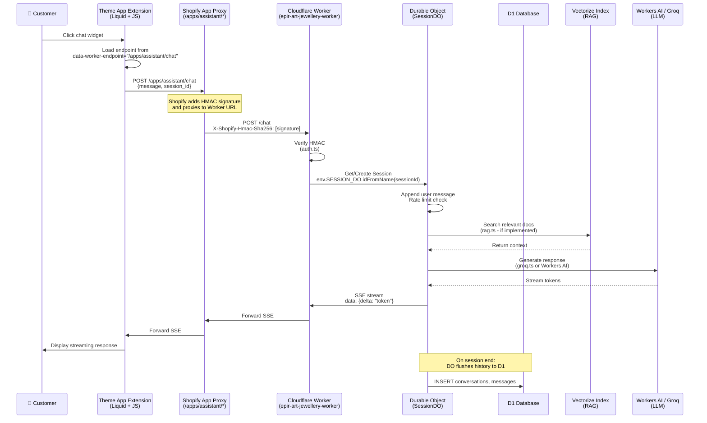
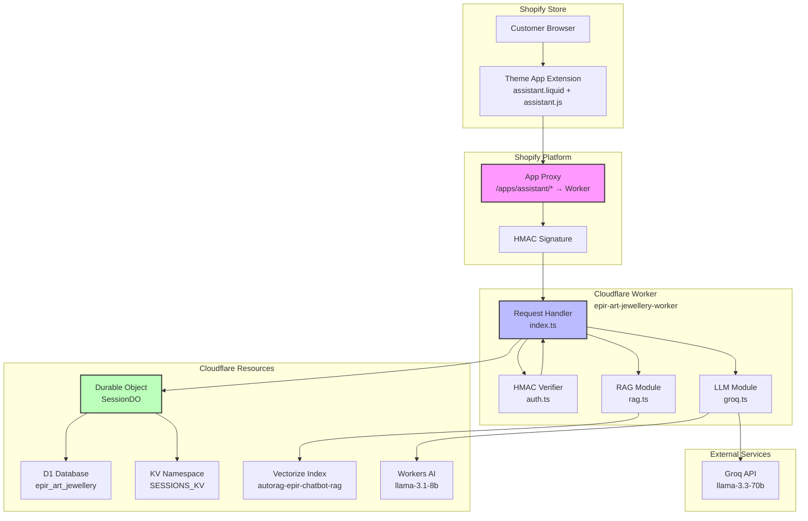
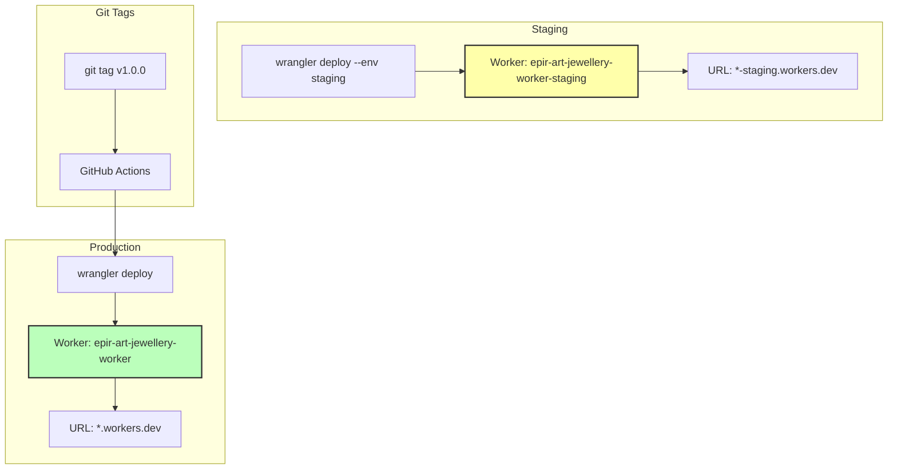
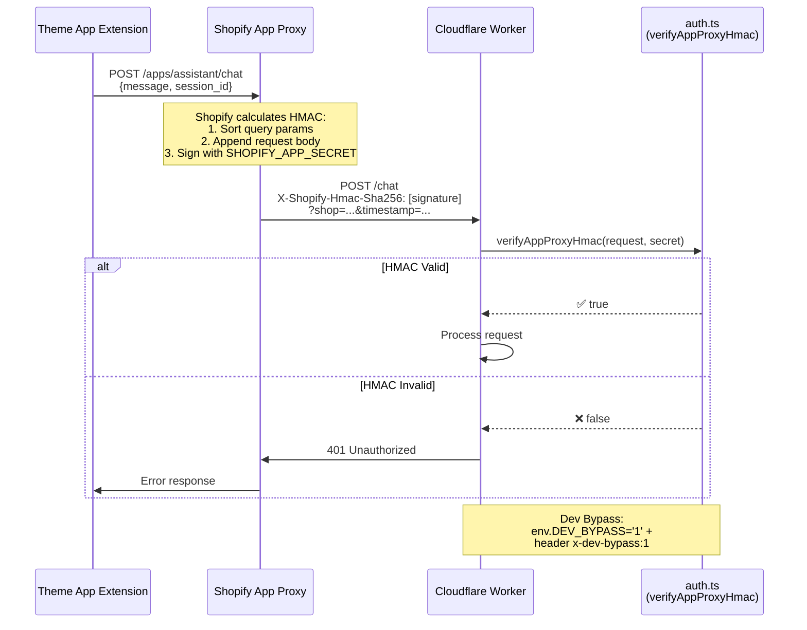

# EPIR Assistant - Fixed Architecture Diagram

## Request Flow (Shopify → Worker)



## Component Architecture



## Configuration Mapping

```mermaid
graph LR
    subgraph "shopify.app.toml"
        A1[prefix = 'apps']
        A2[subpath = 'assistant']
        A3[url = worker URL]
    end
    
    subgraph "TAE assistant.liquid"
        B1[data-worker-endpoint<br/>/apps/assistant/chat]
    end
    
    subgraph "worker/wrangler.toml"
        C1[name = epir-art-jewellery-worker]
        C2[D1: DB binding]
        C3[KV: SESSIONS_KV]
        C4[DO: SESSION_DO]
        C5[Vectorize: VECTOR_INDEX]
        C6[AI binding]
    end
    
    subgraph "Shopify Proxy Result"
        D1[/apps/assistant/* <br/>proxies to Worker]
    end
    
    A1 --> D1
    A2 --> D1
    A3 --> D1
    B1 --> D1
    C1 --> D1
    C2 --> C1
    C3 --> C1
    C4 --> C1
    C5 --> C1
    C6 --> C1
    
    style D1 fill:#ffa,stroke:#333,stroke-width:3px
```

## Fixed Issues Summary

### ❌ Before Fix
```
TAE Endpoint: /apps/epir-assistant/chat (WRONG - typo with "epir-" prefix)
                          ↓ (404 - not found)
App Proxy:    /apps/assistant/* → Worker (MISMATCH)
```

### ✅ After Fix
```
TAE Endpoint: /apps/assistant/chat (CORRECT)
                          ↓ (matches)
App Proxy:    /apps/assistant/* → Worker (PERFECT MATCH)
                          ↓
Worker:       epir-art-jewellery-worker (with all bindings)
```

## Bindings Configuration

### Production Worker
- **Name**: `epir-art-jewellery-worker`
- **URL**: `https://epir-art-jewellery-worker.krzysztofdzugaj.workers.dev`

| Binding | Type | Resource | Purpose |
|---------|------|----------|---------|
| `DB` | D1 Database | `epir_art_jewellery` | Store conversations & messages |
| `SESSIONS_KV` | KV Namespace | `08f16276a9b1...` | Session metadata cache |
| `SESSION_DO` | Durable Object | `SessionDO` | Stateful session handling |
| `VECTOR_INDEX` | Vectorize | `autorag-epir-chatbot-rag` | RAG semantic search |
| `AI` | Workers AI | Built-in | LLM inference (fallback) |

### Staging Worker
- **Name**: `epir-art-jewellery-worker-staging`
- **URL**: `https://epir-art-jewellery-worker-staging.krzysztofdzugaj.workers.dev`
- **Config**: Same bindings, separate environment for testing

## Deployment Environments



## Security Flow (HMAC Verification)



---

**Legend:**
- 🟢 Green: Production-ready components
- 🟡 Yellow: Staging/development components
- 🔵 Blue: Core processing components
- 🔴 Red: External dependencies

**Status**: ✅ Architecture Fixed and Documented
