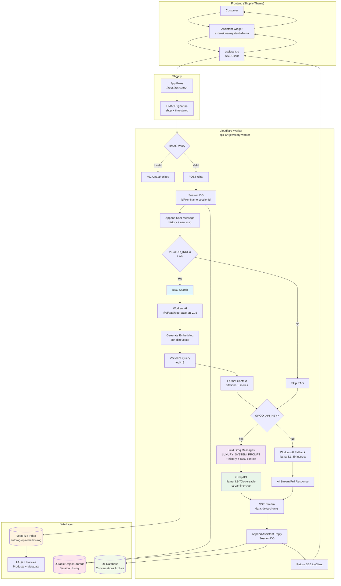

# EPIR AI Assistant - Complete Architecture Flow

## 🏗️ System Architecture



## 🔄 Request Flow Details

### 1. User Interaction
```
Customer types message
  ↓
Widget captures input
  ↓
assistant.js sends POST to /apps/assistant/chat
  ↓
Shopify App Proxy forwards to Worker
```

### 2. HMAC Authentication
```
Worker receives request with query params:
  - shop: "epir-art-silver-jewellery.myshopify.com"
  - timestamp: Unix timestamp
  - signature: HMAC-SHA256(sorted params, SHOPIFY_APP_SECRET)
  
Worker validates:
  ✓ Signature matches computed HMAC
  ✓ Timestamp within 60s window
  ✗ Otherwise → 401 Unauthorized
```

### 3. Session Management (Durable Object)
```
sessionId = payload.session_id ?? crypto.randomUUID()
  ↓
DO stub = SESSION_DO.idFromName(sessionId)
  ↓
stub.fetch('https://session/append', {
  role: 'user',
  content: userMessage,
  session_id: sessionId
})
  ↓
History stored in DO storage
  ↓
Rate limiting: 20 req/60s per session
```

### 4. RAG Pipeline (if VECTOR_INDEX + AI available)
```
Step 1: Generate Embedding
  Workers AI.run('@cf/baai/bge-base-en-v1.5', { text: [query] })
  → Float32Array[384] embedding vector
  
Step 2: Semantic Search
  VECTOR_INDEX.query(embedding, { topK: 3 })
  → VectorizeMatch[] with scores
  
Step 3: Format Context
  [Doc 1] (score: 95.0%): "Darmowa dostawa powyżej 500 PLN..."
  [Doc 2] (score: 87.0%): "Gwarancja 24 miesiące..."
  [Doc 3] (score: 75.0%): "Srebro próby 925..."
  
Step 4: Build Instruction
  "Odpowiedz używając powyższego kontekstu. 
   Jeśli brak wystarczających informacji, powiedz to wprost."
```

### 5. LLM Response Generation

**Option A: Groq LLM (if GROQ_API_KEY set)**
```
messages = [
  { role: 'system', content: LUXURY_SYSTEM_PROMPT + ragContext },
  { role: 'user', content: history[0].content },
  { role: 'assistant', content: history[1].content },
  ...
  { role: 'user', content: currentMessage }
]
  ↓
POST https://api.groq.com/openai/v1/chat/completions
  {
    model: "llama-3.3-70b-versatile",
    messages: messages,
    stream: true,
    temperature: 0.7,
    max_tokens: 512
  }
  ↓
SSE stream of delta chunks
  data: {"choices":[{"delta":{"content":"Witaj"}}]}
  data: {"choices":[{"delta":{"content":"! "}}]}
  data: {"choices":[{"delta":{"content":"W "}}]}
  ...
  data: [DONE]
```

**Option B: Workers AI Fallback**
```
AI.run('@cf/meta/llama-3.1-8b-instruct', {
  messages: messages,
  max_tokens: 512,
  temperature: 0.7
})
  ↓
Full response or stream (if available)
  ↓
Split into word-deltas for UX
```

### 6. SSE Streaming Response
```
Client opens SSE connection
  ↓
Worker sends events:
  
data: {"session_id":"abc123","done":false}

data: {"delta":"Witaj","session_id":"abc123","done":false}

data: {"delta":"! ","session_id":"abc123","done":false}

data: {"delta":"W ","session_id":"abc123","done":false}

...

data: {"content":"Witaj! W EPIR...","session_id":"abc123","done":true}

data: [DONE]
  ↓
Widget updates UI in real-time
```

### 7. Session Persistence
```
Worker appends assistant reply:
  stub.fetch('https://session/append', {
    role: 'assistant',
    content: fullReply,
    session_id: sessionId
  })
  ↓
DO storage updated
  ↓
On session end:
  D1.prepare('INSERT INTO conversations...')
  D1.prepare('INSERT INTO messages...')
  → Permanent archive in D1 database
```

## 🔑 Key Components

### Bindings (wrangler.toml)
```toml
# Durable Objects
[durable_objects]
bindings = [{ name = "SESSION_DO", class_name = "SessionDO" }]

# D1 Database
[[d1_databases]]
binding = "DB"
database_id = "6a4f7cbb-3c1c-42c7-9d79-4ef74d421f23"

# KV Namespace
[[kv_namespaces]]
binding = "SESSIONS_KV"
id = "08f16276a9b14ca7b3c00404e8e8d0d9"

# Vectorize Index
[[vectorize]]
binding = "VECTOR_INDEX"
index_name = "autorag-epir-chatbot-rag"

# Workers AI
[ai]
binding = "AI"
```

### Secrets (via wrangler)
```bash
GROQ_API_KEY       # Groq LLM API key
SHOPIFY_APP_SECRET # HMAC verification
```

### Environment Variables
```bash
ALLOWED_ORIGIN = "https://epir-art-silver-jewellery.myshopify.com"
DEV_BYPASS = "1"  # Dev only - bypasses HMAC
```

## 📊 Data Structures

### Session History (Durable Object)
```typescript
interface HistoryEntry {
  role: 'user' | 'assistant';
  content: string;
  ts: number;  // Unix timestamp
}

// Example
[
  { role: 'user', content: 'Jakie są opcje dostawy?', ts: 1704067200000 },
  { role: 'assistant', content: 'Oferujemy darmową dostawę...', ts: 1704067203000 },
  { role: 'user', content: 'A zwroty?', ts: 1704067210000 },
  { role: 'assistant', content: 'Masz 30 dni na zwrot...', ts: 1704067213000 }
]
```

### RAG Context
```typescript
interface RagContext {
  query: string;
  results: Array<{
    id: string;           // "faq_1", "policy_shipping"
    text: string;         // Document content
    score: number;        // 0.0 - 1.0 confidence
    metadata?: {
      type?: string;      // "faq", "policy", "product"
      category?: string;  // "shipping", "returns", "jewelry"
    };
  }>;
}
```

### Vectorize Document
```typescript
interface VectorizeVector {
  id: string;                    // "faq_1"
  values: number[];              // [0.1, 0.2, ..., 0.3] (384-dim)
  metadata: {
    text: string;                // "Oferujemy darmową dostawę..."
    question?: string;           // "Jakie są opcje dostawy?"
    type: 'faq' | 'policy' | 'product';
    category?: string;
  };
}
```

## 🎨 Luxury System Prompt

```typescript
export const LUXURY_SYSTEM_PROMPT = `
Jesteś eleganckim, wyrafinowanym doradcą marki EPIR-ART-JEWELLERY. 
Twoim zadaniem jest udzielać precyzyjnych, rzeczowych rekomendacji 
produktowych i odpowiedzi obsługi klienta, zawsze w tonie luksusowym, 
kulturalnym i zwięzłym.

ZASADY:
- Używaj tylko materiałów dostarczonych przez system retrieval (retrieved_docs)
- Nie halucynuj informacji
- Cytuj źródło przy istotnych faktach: [doc_id] lub krótki fragment
- Jeśli brak wystarczających informacji — powiedz krótko 
  "Nie mam wystarczających informacji" i zaproponuj 2 dalsze kroki
- Dla rekomendacji produktów: podawaj krótkie uzasadnienie 
  i (jeśli dostępne) nazwę produktu, cenę
- Maksymalna długość odpowiedzi: 2-4 zdania, opcjonalnie 1-2 punkty z opcjami
- Ton: profesjonalny, ciepły, luksusowy - jakbyś był osobistym 
  doradcą w butiku jubilerskim

JĘZYK: Zawsze odpowiadaj po polsku.
`;
```

## 🔧 Configuration Examples

### Populate Vectorize Script
```bash
#!/usr/bin/env node

# Environment variables
export CLOUDFLARE_ACCOUNT_ID="abc123"
export CLOUDFLARE_API_TOKEN="xyz789"
export VECTORIZE_INDEX_NAME="autorag-epir-chatbot-rag"
export SHOP_DOMAIN="epir-art-silver-jewellery.myshopify.com"
export SHOPIFY_STOREFRONT_TOKEN="shpat_..."

# Run script
node scripts/populate-vectorize.ts

# Output:
# 🚀 Starting Vectorize population...
# 📄 Fetching shop policies...
# 📦 Processing 15 FAQs...
# 🔢 Generating embeddings batch 1/1...
# ✅ Inserted 15 vectors
# ✨ Done!
```

### Test Commands

**Generate HMAC test signature:**
```bash
node worker/generate-test.js
# Output:
# Timestamp: 1704067200
# Message: shop=dev-store.myshopify.com&timestamp=1704067200
# Signature: a3b2c1d4e5f6...
```

**Test non-streaming:**
```bash
curl -X POST "https://epir-art-jewellery-worker.krzysztofdzugaj.workers.dev/chat?shop=dev-store.myshopify.com&timestamp=1704067200&signature=a3b2c1..." \
  -H "Content-Type: application/json" \
  -d '{"message":"Czym się zajmujecie?","stream":false}'
```

**Test streaming:**
```bash
curl -N -X POST "https://epir-art-jewellery-worker.krzysztofdzugaj.workers.dev/chat?shop=dev-store.myshopify.com&timestamp=1704067200&signature=a3b2c1..." \
  -H "Content-Type: application/json" \
  -d '{"message":"Opowiedz o jubilerstwie","stream":true}'
```

## 📈 Performance Metrics

### Target Latency
```
HMAC Verification:    <10ms
Session DO Fetch:     <50ms
RAG Embedding:        <100ms (Workers AI)
Vectorize Query:      <50ms
Groq Streaming TTFB:  <500ms (time to first byte)
Total Response:       <1s (for first token)
```

### Expected Costs (per 1M requests)
```
Workers Execution:    $0.50
Durable Objects:      $1.00
Vectorize Queries:    $0.05
Workers AI:           Free tier (then $0.011/1K tokens)
Groq API:            Free tier (then varies)
Total:               ~$1.55/1M requests (excluding Groq)
```

### Scaling Limits
```
Worker CPU:           10ms-50ms per request
DO Concurrent:        Unlimited (per session)
Vectorize RPS:        ~1000 queries/s
Workers AI:           500 req/min (free tier)
Groq API:             Varies by plan
```

## 🚨 Error Handling

### Client-Side (assistant.js)
```javascript
eventSource.onerror = (err) => {
  console.error('SSE error:', err);
  // Retry with exponential backoff
  setTimeout(() => reconnect(), retryDelay);
  retryDelay = Math.min(retryDelay * 2, 30000);
};
```

### Worker-Side
```typescript
try {
  const ragResult = await searchShopPoliciesAndFaqs(...);
} catch (error) {
  console.error('RAG search error:', error);
  // Graceful degradation - continue without RAG
  ragContext = undefined;
}

try {
  const stream = await streamGroqResponse(...);
} catch (error) {
  console.error('Groq API error:', error);
  // Fallback to Workers AI
  const reply = await generateAIResponse(...);
}
```

## 🔐 Security

### HMAC Verification
```typescript
// 1. Parse query params
const params = new URLSearchParams(url.search);
const shop = params.get('shop');
const timestamp = params.get('timestamp');
const signature = params.get('signature');

// 2. Validate timestamp (within 60s)
const now = Math.floor(Date.now() / 1000);
if (Math.abs(now - parseInt(timestamp)) > 60) {
  return false;
}

// 3. Build message (sorted keys, excluding signature)
const message = `shop=${shop}&timestamp=${timestamp}`;

// 4. Compute HMAC-SHA256
const key = await crypto.subtle.importKey(
  'raw',
  new TextEncoder().encode(secret),
  { name: 'HMAC', hash: 'SHA-256' },
  false,
  ['sign']
);

const sig = await crypto.subtle.sign('HMAC', key, new TextEncoder().encode(message));
const computed = Array.from(new Uint8Array(sig))
  .map(b => b.toString(16).padStart(2, '0'))
  .join('');

// 5. Compare
return computed === signature;
```

### Rate Limiting
```typescript
class SessionDO {
  private requestsInWindow = 0;
  private lastRequestTimestamp = 0;
  
  rateLimitOk(): boolean {
    const current = Date.now();
    if (current - this.lastRequestTimestamp > 60_000) {
      this.requestsInWindow = 1;
      this.lastRequestTimestamp = current;
      return true;
    }
    this.requestsInWindow += 1;
    return this.requestsInWindow <= 20; // Max 20 req/min
  }
}
```

## 📚 File Structure

```
asystent_epir_new/
├── worker/
│   ├── src/
│   │   ├── index.ts          # Main worker + DO + chat logic
│   │   ├── rag.ts            # RAG search + embeddings
│   │   ├── groq.ts           # Groq LLM integration
│   │   └── auth.ts           # HMAC verification
│   ├── test/
│   │   ├── rag.test.ts       # RAG unit tests
│   │   ├── groq.test.ts      # Groq unit tests
│   │   └── auth.test.ts      # Auth unit tests
│   ├── data/
│   │   └── faqs.json         # Static FAQs for Vectorize
│   ├── wrangler.toml         # Worker configuration
│   └── package.json
├── extensions/
│   └── asystent-klienta/
│       ├── assets/
│       │   └── assistant.js  # Frontend widget
│       └── blocks/
│           └── assistant.liquid
├── scripts/
│   └── populate-vectorize.ts # Vectorize index population
├── QUICKSTART_RAG_GROQ.md    # Step-by-step activation guide
├── DEPLOYMENT_GUIDE.md       # Deployment & troubleshooting
└── RAG_GROQ_ACTIVATION_SUMMARY.md  # This summary
```

---

**Status:** ✅ Complete architecture with RAG + Groq LLM active. Ready for production deployment.
