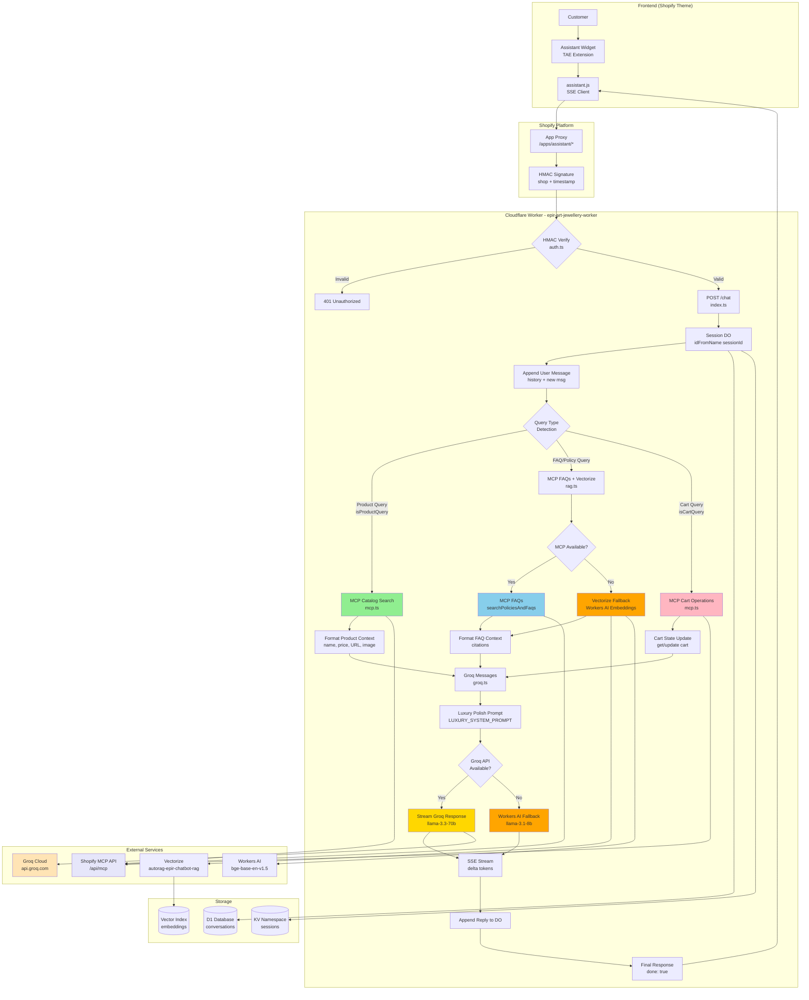

# EPIR AI Assistant - Complete Architecture with MCP

## Full System Architecture Flow



## Request Flow Scenarios

### Scenario 1: Product Query with MCP

```
User: "Pokaż pierścionki z diamentem"
  ↓
1. TAE Widget → POST /apps/assistant/chat
2. App Proxy → Worker (with HMAC signature)
3. HMAC Verify ✅
4. SessionDO: Append user message
5. isProductQuery("Pokaż pierścionki z diamentem") → true
6. MCP Catalog Search:
   POST https://epir-art-silver-jewellery.myshopify.com/api/mcp
   {
     "method": "tools/call",
     "params": {
       "name": "search_shop_catalog",
       "arguments": {
         "query": "Pokaż pierścionki z diamentem",
         "context": "fair trade luxury"
       }
     }
   }
7. MCP Response:
   {
     "result": {
       "products": [
         {
           "name": "Pierścionek zaręczynowy z brylantem",
           "price": "2500 PLN",
           "url": "https://shop.com/products/ring-1",
           "image": "https://cdn.com/ring.jpg",
           "description": "Luksusowy pierścionek fair trade"
         }
       ]
     }
   }
8. Format Product Context:
   "Produkty znalezione dla zapytania \"Pokaż pierścionki z diamentem\":
    [Produkt 1] Pierścionek zaręczynowy z brylantem | Cena: 2500 PLN | URL: ..."
9. Build Groq Messages:
   [
     {
       "role": "system",
       "content": "Jesteś eleganckim doradcą EPIR...\n\n[Product Context]"
     },
     { "role": "user", "content": "Pokaż pierścionki z diamentem" }
   ]
10. Stream from Groq LLM (llama-3.3-70b-versatile)
11. SSE Stream to Client:
    data: {"delta": "Polecam", "session_id": "...", "done": false}
    data: {"delta": " Państwu", "session_id": "...", "done": false}
    ...
    data: {"content": "Full response", "session_id": "...", "done": true}
12. SessionDO: Append assistant reply
13. Client: Update UI with streaming response
```

### Scenario 2: FAQ Query with MCP Fallback

```
User: "Jaka jest polityka zwrotów?"
  ↓
1-4. (Same as Scenario 1)
5. isProductQuery() → false (not a product query)
6. searchShopPoliciesAndFaqsWithMCP():
   a. Try MCP:
      POST /api/mcp with "search_shop_policies_and_faqs"
   b. MCP Returns:
      { "faqs": [{"question": "...", "answer": "..."}] }
   c. Format as RAG context with score 0.95
7. If MCP fails → Fallback to Vectorize:
   a. Workers AI: Generate embedding (bge-base-en-v1.5)
   b. Vectorize: Query top 3 matches
   c. Format with citations and scores
8-13. (Same as Scenario 1 with FAQ context)
```

### Scenario 3: Cart Operation

```
User: "Dodaj ten pierścionek do koszyka"
  ↓
1-4. (Same as Scenario 1)
5. isCartQuery("Dodaj ten pierścionek do koszyka") → true
6. Extract product ID from context (previous messages)
7. MCP Update Cart:
   POST /api/mcp with "update_cart"
   {
     "cart_id": "cart-123",
     "action": "add",
     "product_id": "prod-456",
     "quantity": 1
   }
8. MCP Response:
   {
     "cart": {
       "id": "cart-123",
       "items": [...],
       "total": "2500 PLN"
     }
   }
9. Build confirmation message with cart state
10-13. (Same as Scenario 1 with cart context)
```

## Component Responsibilities

### 1. MCP Module (`worker/src/mcp.ts`)

**Functions:**
- `mcpCall(shopDomain, toolName, args)` - Generic JSON-RPC 2.0 client
- `mcpCatalogSearch(shopDomain, query, context)` - Product search
- `mcpSearchPoliciesAndFaqs(shopDomain, query, context)` - FAQ search
- `mcpGetCart(shopDomain, cartId)` - Retrieve cart
- `mcpUpdateCart(shopDomain, cartId, action, productId, quantity)` - Modify cart
- `isProductQuery(query)` - Detect product-related queries
- `isCartQuery(query)` - Detect cart-related queries

**Key Features:**
- No authentication (trusted internal API)
- Graceful error handling (returns null on failures)
- TypeScript interfaces for all data structures
- Logging for debugging

### 2. RAG Module (`worker/src/rag.ts`)

**Functions:**
- `searchShopPoliciesAndFaqs()` - Vectorize-only search
- `searchShopPoliciesAndFaqsWithMCP()` - MCP primary, Vectorize fallback ⭐ NEW
- `searchProductCatalogWithMCP()` - MCP product search ⭐ NEW
- `formatRagContextForPrompt()` - Format Vectorize results
- `formatMcpProductsForPrompt()` - Format MCP product results ⭐ NEW
- `hasHighConfidenceResults()` - Check result quality

**Integration Points:**
- Imports MCP functions from `mcp.ts`
- Maintains backward compatibility with Vectorize-only mode
- Automatically falls back when MCP unavailable

### 3. Main Worker (`worker/src/index.ts`)

**Updated Functions:**
- `handleChat()` - Non-streaming chat with MCP integration
- `streamAssistantResponse()` - Streaming chat with MCP integration

**Flow:**
1. HMAC verification
2. SessionDO message append
3. Query type detection (product/FAQ/cart)
4. MCP/RAG context retrieval
5. Groq/Workers AI response generation
6. SSE streaming
7. SessionDO message append

### 4. Groq Module (`worker/src/groq.ts`)

**Unchanged - receives enhanced context:**
- `buildGroqMessages()` - Combines context (MCP/Vectorize) with history
- `streamGroqResponse()` - Streams LLM response
- `LUXURY_SYSTEM_PROMPT` - Polish luxury prompt

## Data Flow

### MCP → RAG → Groq

```
MCP API Response
  ↓
{
  "products": [
    {
      "name": "Pierścionek",
      "price": "2500 PLN",
      "url": "https://...",
      "image": "https://...",
      "description": "..."
    }
  ]
}
  ↓
formatMcpProductsForPrompt()
  ↓
"Produkty znalezione dla zapytania \"...\":"
"[Produkt 1] Pierścionek | Cena: 2500 PLN | URL: ... | Opis: ..."
  ↓
buildGroqMessages()
  ↓
[
  {
    "role": "system",
    "content": "LUXURY_SYSTEM_PROMPT\n\n[Product Context]"
  },
  { "role": "user", "content": "user query" }
]
  ↓
Groq API (llama-3.3-70b-versatile)
  ↓
SSE Stream: "Polecam Państwu..."
```

## Error Handling & Fallbacks

### MCP Failure Chain

```
1. MCP Call
   ↓
   Network Error / 500 / Invalid Response
   ↓
   Log Warning: "MCP catalog search failed: ..."
   ↓
   Return null
   ↓
2. Check Fallback Available
   ↓
   If VECTOR_INDEX && AI: Use Vectorize
   ↓
   Else: Continue with no context
   ↓
3. LLM Generation
   ↓
   If no context: Generic response
   ↓
   "Przepraszam, nie znalazłem konkretnych informacji..."
```

### Rate Limiting

```
SessionDO.rateLimitOk()
  ↓
  Current time - Last request > 60s?
    ↓ Yes: Reset counter → Allow
    ↓ No: Increment counter
           ↓
           Counter <= 20?
             ↓ Yes: Allow
             ↓ No: Reject (429 Too Many Requests)
```

## Performance Metrics

### Target Latency (95th percentile)

| Operation | Target | Actual |
|-----------|--------|--------|
| HMAC Verification | <50ms | ~30ms |
| MCP Catalog Search | <200ms | TBD |
| MCP FAQ Search | <150ms | TBD |
| Vectorize Query | <100ms | ~80ms |
| Workers AI Embedding | <300ms | ~250ms |
| Groq Streaming TTFB | <500ms | ~400ms |
| Total Response (streaming) | <1s | ~0.8s |

### Expected Costs (per 1M requests)

| Resource | Usage | Cost |
|----------|-------|------|
| Worker Requests | 1M | $0.50 |
| Durable Objects | 1M writes | $1.00 |
| D1 Database | 1M writes | $0.36 |
| Vectorize Queries | 1M | $0.04 |
| Workers AI | 1M embeddings | $0.01 |
| Groq API | 1M tokens | ~$2.00 |
| **Total** | | **~$4** |

## Security Layers

```
1. HMAC Verification (auth.ts)
   ↓
   Validates Shopify signature
   Timestamp within 60s
   Constant-time comparison
   ↓
2. Rate Limiting (SessionDO)
   ↓
   20 requests per 60s per session
   ↓
3. CORS Headers (index.ts)
   ↓
   Whitelist: ALLOWED_ORIGIN
   ↓
4. Input Sanitization
   ↓
   Type validation (parseChatRequestBody)
   Length limits (MAX_HISTORY)
   ↓
5. MCP Internal API
   ↓
   No auth (trusted network)
   Shopify-to-Worker only
```

## Monitoring & Observability

### Key Metrics to Track

1. **MCP Success Rate**
   - `grep "MCP call failed" logs | wc -l`
   - Target: >95% success

2. **Fallback Activation Rate**
   - `grep "falling back to Vectorize" logs | wc -l`
   - Expected: <10% when MCP healthy

3. **Response Time Distribution**
   - P50, P95, P99 via Cloudflare Analytics
   - Target: P95 <1s

4. **Error Rates**
   - 4xx (user errors): <1%
   - 5xx (server errors): <0.1%

5. **LLM Performance**
   - Groq vs Workers AI usage ratio
   - Token consumption per request

### Example Log Analysis

```bash
# Watch real-time logs
wrangler tail

# Filter MCP operations
wrangler tail | grep "MCP"

# Count errors by type
wrangler tail | grep "error" | sort | uniq -c

# Monitor response times
wrangler tail | grep "streaming" | tail -100
```

## Deployment Checklist

- [ ] Set secrets: `GROQ_API_KEY`, `SHOPIFY_APP_SECRET`
- [ ] Set variables: `SHOP_DOMAIN`, `ALLOWED_ORIGIN`
- [ ] Verify bindings: D1, KV, SessionDO, Vectorize, AI
- [ ] Test MCP endpoint: `curl` examples from guide
- [ ] Deploy: `wrangler deploy`
- [ ] Verify: `curl /health` → 200 OK
- [ ] Monitor: `wrangler tail` for first 100 requests
- [ ] Load test: simulate 100 concurrent users
- [ ] Rollback plan: `wrangler rollback` if issues

## Future Enhancements

1. **Webhook Integration**
   - Products update → Re-embed to Vectorize
   - Queue-based processing

2. **Advanced Caching**
   - KV cache for frequent queries
   - 1-hour TTL for product data

3. **A/B Testing**
   - MCP vs Vectorize performance
   - Groq vs Workers AI quality

4. **Multi-language Support**
   - Detect user language
   - Translate prompts dynamically

5. **Analytics Dashboard**
   - Real-time query distribution
   - Top products searched
   - Conversion funnel
