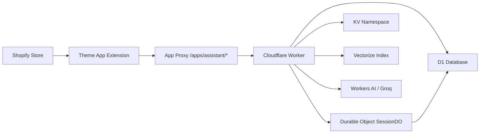

# EPIR Assistant - Deployment Guide & Architecture

## 🏗️ Architecture Overview

### Flow Diagram (TAE → App Proxy → Worker)



### Component Details

| Component | Configuration | Purpose |
|-----------|--------------|---------|
| **Worker Name** | `epir-art-jewellery-worker` | Main Cloudflare Worker |
| **App Proxy** | `/apps/assistant/*` → Worker URL | Shopify proxy to Worker |
| **TAE Endpoint** | `/apps/assistant/chat` | Frontend chat endpoint |
| **Bindings** | D1, KV, DO, Vectorize, AI | Worker resources |

## 📋 Configuration Files

### 1. Worker Configuration (`worker/wrangler.toml`)

```toml
name = "epir-art-jewellery-worker"

# Bindings (Production)
[durable_objects]
bindings = [{ name = "SESSION_DO", class_name = "SessionDO" }]

[[d1_databases]]
binding = "DB"
database_id = "6a4f7cbb-3c1c-42c7-9d79-4ef74d421f23"

[[kv_namespaces]]
binding = "SESSIONS_KV"
id = "08f16276a9b14ca7b3c00404e8e8d0d9"

[[vectorize]]
binding = "VECTOR_INDEX"
index_name = "autorag-epir-chatbot-rag"

[ai]
binding = "AI"
```

### 2. Shopify App Proxy (`shopify.app.toml`)

```toml
[app_proxy]
url = "https://epir-art-jewellery-worker.krzysztofdzugaj.workers.dev"
subpath = "assistant"
prefix = "apps"
```

**Result**: Shopify proxies `/apps/assistant/*` to Worker

### 3. Theme App Extension (`extensions/asystent-klienta/blocks/assistant.liquid`)

```liquid
<section id="epir-assistant-section"
  data-worker-endpoint="/apps/assistant/chat"
>
```

**Important**: Endpoint must match App Proxy path (`/apps/assistant/chat`)

## 🚀 Deployment Process

### Prerequisites

1. **Cloudflare Secrets** (set once):
   ```bash
   cd worker
   wrangler secret put SHOPIFY_APP_SECRET
   wrangler secret put GROQ_API_KEY  # Optional, for Groq LLM
   ```

2. **Cloudflare Resources** (already configured):
   - ✅ D1 Database: `epir_art_jewellery`
   - ✅ KV Namespace: `SESSIONS_KV`
   - ✅ Durable Object: `SessionDO`
   - ✅ Vectorize Index: `autorag-epir-chatbot-rag`
   - ✅ Workers AI: Binding configured

### Manual Deployment

#### Production Deploy
```bash
cd worker
npm install
npm test                    # Run tests first
npx tsc --noEmit           # Type check
wrangler deploy            # Deploy to production
```

#### Staging Deploy
```bash
cd worker
wrangler deploy --env staging
```

### Automated Deployment (GitHub Actions)

#### Deploy via Git Tag
```bash
git tag v1.0.0
git push origin v1.0.0
```

#### Manual Workflow Trigger
1. Go to Actions → Deploy workflow
2. Click "Run workflow"
3. Select environment: `production` or `staging`
4. Run workflow

## 🔧 Environment Configuration

### Production
- **Name**: `epir-art-jewellery-worker`
- **URL**: `https://epir-art-jewellery-worker.krzysztofdzugaj.workers.dev`
- **Deploy**: `wrangler deploy`

### Staging
- **Name**: `epir-art-jewellery-worker-staging`
- **URL**: `https://epir-art-jewellery-worker-staging.krzysztofdzugaj.workers.dev`
- **Deploy**: `wrangler deploy --env staging`
- **Purpose**: Testing before production

## 🔍 Verification & Testing

### 1. Health Check
```bash
curl https://epir-art-jewellery-worker.krzysztofdzugaj.workers.dev/health
```

### 2. HMAC Test (App Proxy)
```powershell
# Use the test script
./scripts/test_appproxy_hmac.ps1
```

### 3. Chat Test
```bash
# Generate signed request
cd worker
node generate-test.js

# Use generated curl command
```

### 4. SSE Streaming Test
```bash
curl -N -X POST "https://epir-art-jewellery-worker.krzysztofdzugaj.workers.dev/chat" \
  -H "Content-Type: application/json" \
  -H "X-Shopify-Hmac-Sha256: [SIGNED_HMAC]" \
  -d '{"message":"Test streaming","session_id":"test123","stream":true}'
```

## 🐛 Troubleshooting

### Issue: 404 on /apps/assistant/chat

**Cause**: App Proxy not configured or TAE endpoint mismatch

**Solution**:
1. Verify `shopify.app.toml` has correct App Proxy config
2. Check TAE uses `/apps/assistant/chat` (not `/apps/epir-assistant/chat`)
3. Redeploy Shopify app: `shopify app deploy`

### Issue: 401 HMAC Verification Failed

**Cause**: `SHOPIFY_APP_SECRET` not set or incorrect

**Solution**:
```bash
cd worker
wrangler secret put SHOPIFY_APP_SECRET
# Paste the API Secret from Shopify Partners Dashboard
```

### Issue: Bindings Not Found (DB, KV, DO, etc.)

**Cause**: Worker deployed to wrong name or bindings not configured in Cloudflare Dashboard

**Solution**:
1. Check worker name in `wrangler.toml` matches deployed worker
2. Verify bindings in Cloudflare Dashboard: Workers → epir-art-jewellery-worker → Settings → Variables
3. Re-run `wrangler deploy` to sync bindings from `wrangler.toml`

### Issue: RAG/LLM Not Working

**Cause**: Vectorize or AI binding not active

**Solution**:
1. Check Vectorize index populated: `node scripts/populate-vectorize.ts`
2. Verify Workers AI binding in `wrangler.toml`
3. Set `GROQ_API_KEY` for enhanced LLM: `wrangler secret put GROQ_API_KEY`

## 📊 Configuration Summary Table

### Before Fix (Problematic)
| Configuration | Value | Issue |
|--------------|-------|-------|
| Worker Name (old) | `epir-assistant-worker` | ❌ Duplicate, has bindings |
| Worker Name (new) | `epir-art-jewellery-worker` | ❌ Empty, no bindings |
| App Proxy | `/apps/assistant/*` → new worker | ❌ Bindings in old worker |
| TAE Endpoint | `/apps/epir-assistant/chat` | ❌ Wrong path (typo) |

### After Fix (Current)
| Configuration | Value | Status |
|--------------|-------|--------|
| Worker Name | `epir-art-jewellery-worker` | ✅ Unified |
| Bindings | D1, KV, DO, Vectorize, AI in wrangler.toml | ✅ Configured |
| App Proxy | `/apps/assistant/*` → worker | ✅ Correct |
| TAE Endpoint | `/apps/assistant/chat` | ✅ Matches proxy |

## 🔐 Security Best Practices

1. **Never commit secrets** to repository
2. Use Cloudflare secrets for sensitive data:
   - `SHOPIFY_APP_SECRET` (required)
   - `GROQ_API_KEY` (optional)
3. Enable HMAC verification in production (disable `DEV_BYPASS`)
4. Use CORS restrictions via `ALLOWED_ORIGIN`
5. Rate limiting: 20 requests/60s per session (configured in worker)

## 📝 Maintenance

### Update Bindings
1. Edit `worker/wrangler.toml`
2. Run `wrangler deploy` to sync changes
3. Verify in Cloudflare Dashboard

### Update Secrets
```bash
cd worker
wrangler secret put SECRET_NAME
```

### View Logs
```bash
cd worker
wrangler tail
```

### Monitor Performance
- Cloudflare Dashboard → Workers & Pages → epir-art-jewellery-worker
- Check: Requests, Errors, CPU Time, Subrequests

## 🎯 Next Steps

1. ✅ Fix TAE endpoint path (completed)
2. ✅ Add environment configuration (completed)
3. ✅ Update GitHub Actions workflow (completed)
4. 🔄 Implement RAG with Vectorize (see `QUICKSTART_RAG_GROQ.md`)
5. 🔄 Integrate Groq LLM for luxury responses (see `worker/src/groq.ts`)
6. 🔄 Populate Vectorize index with products/FAQs
7. 🔄 Add E2E tests for complete flow

## 📚 Related Documentation

- [QUICKSTART_RAG_GROQ.md](./QUICKSTART_RAG_GROQ.md) - RAG & Groq integration
- [ARCHITECTURE_ANALYSIS.md](./ARCHITECTURE_ANALYSIS.md) - Detailed architecture
- [SUMMARY.md](./SUMMARY.md) - Complete feature overview
- [EVALUATION.md](./EVALUATION.md) - Code quality assessment

---

**Last Updated**: 2025-10-06
**Status**: ✅ Configuration Fixed, Ready for Production Deploy
