# GraphQL Integration - Complete Architecture

## 🏗️ System Architecture with GraphQL

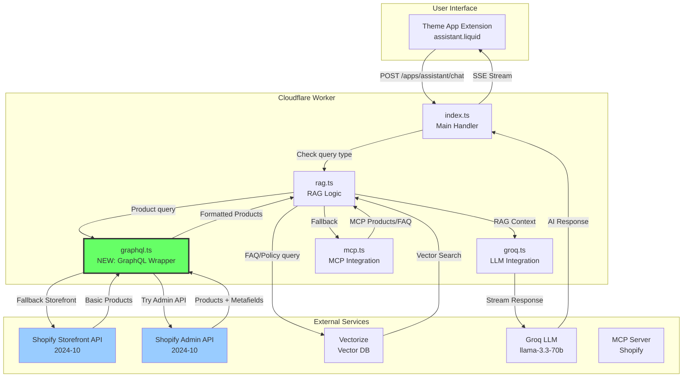

## 🔄 GraphQL Request Flow

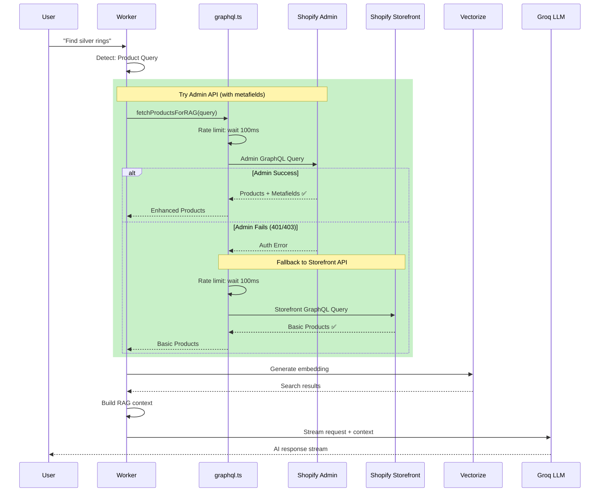

## 📦 Module Dependencies

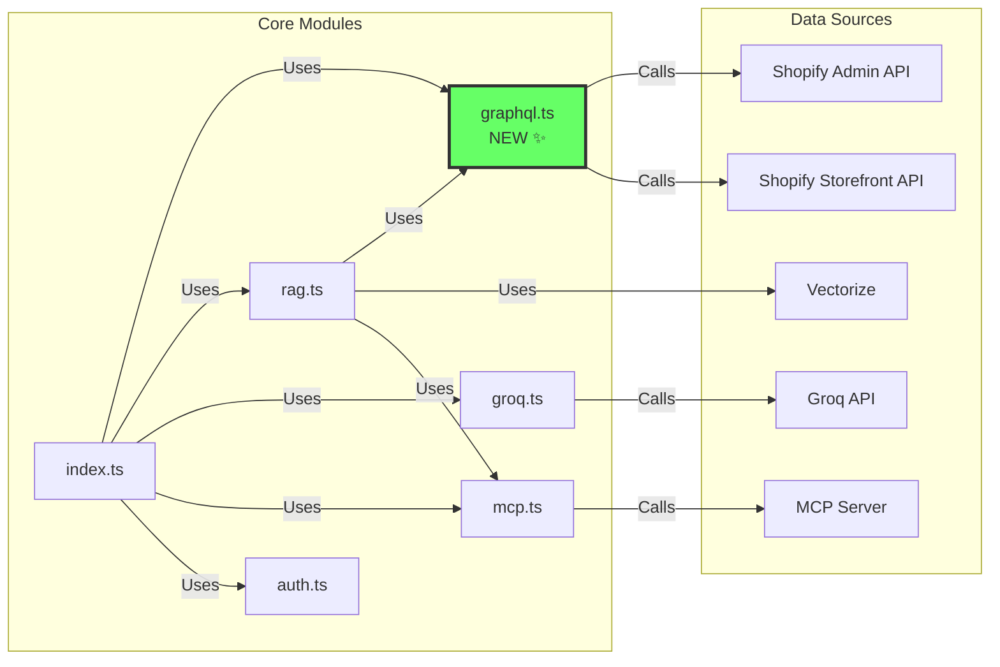

## 🛡️ Error Handling Architecture

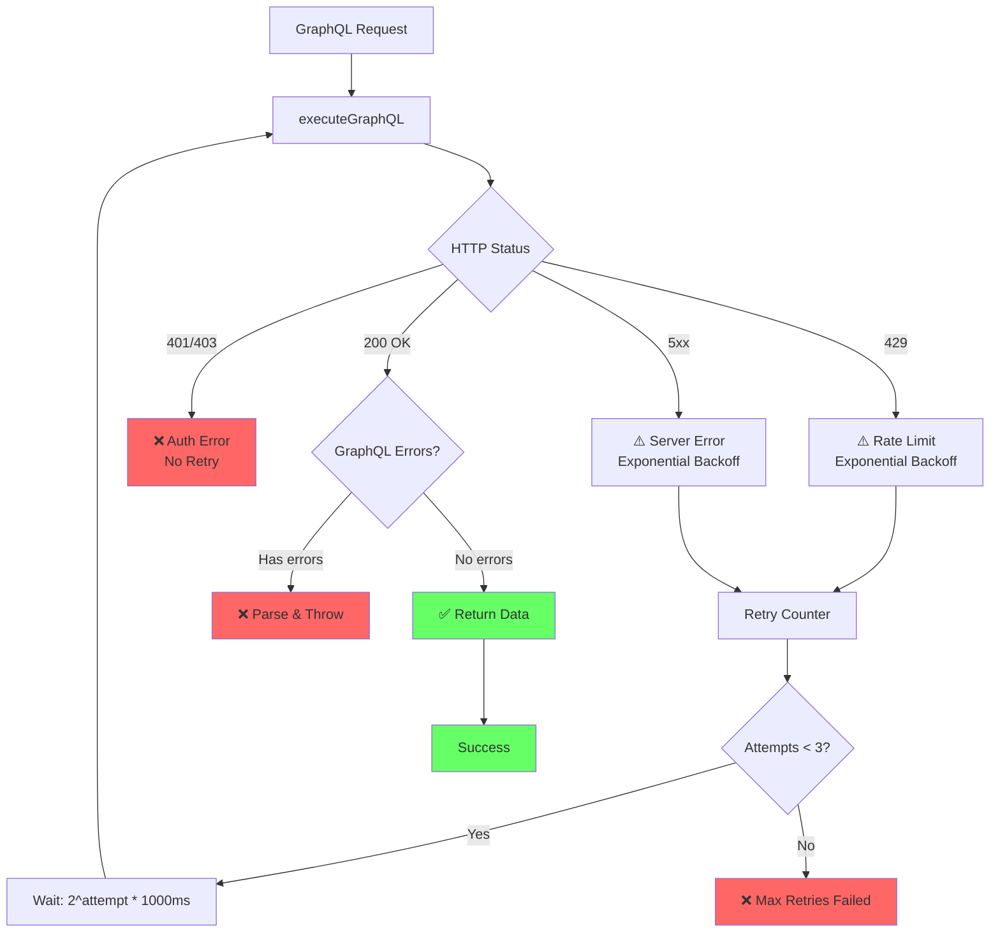

## 🎯 Query Routing Logic

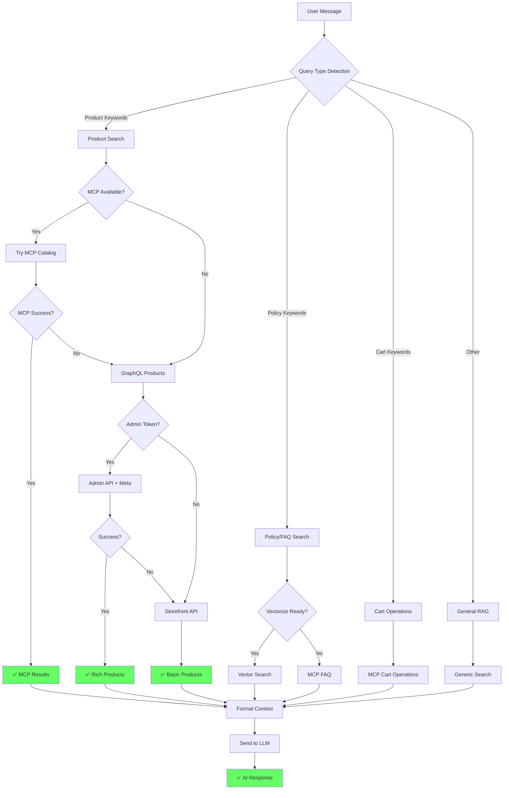

## 📊 Data Flow: populate-vectorize.ts

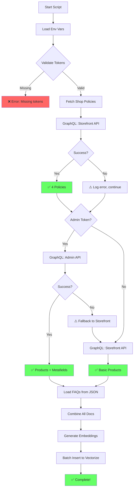

## 🔐 Token & Scope Management

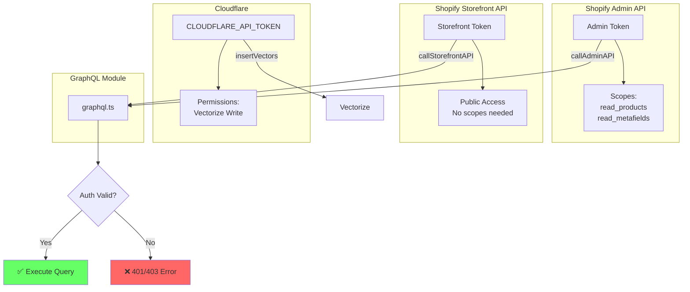

## 📈 Performance Optimization

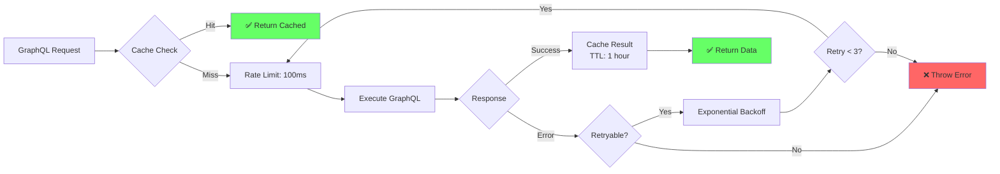

## 🧪 Testing Coverage

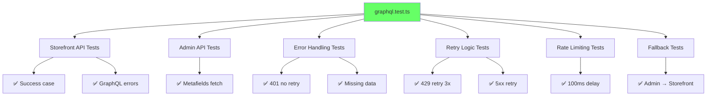

## 📝 Documentation Map

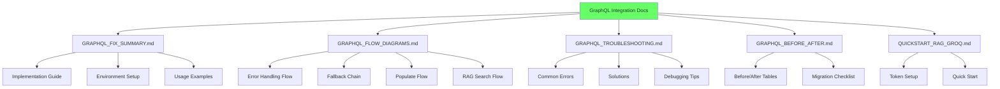

## 🎉 Success Criteria Checklist

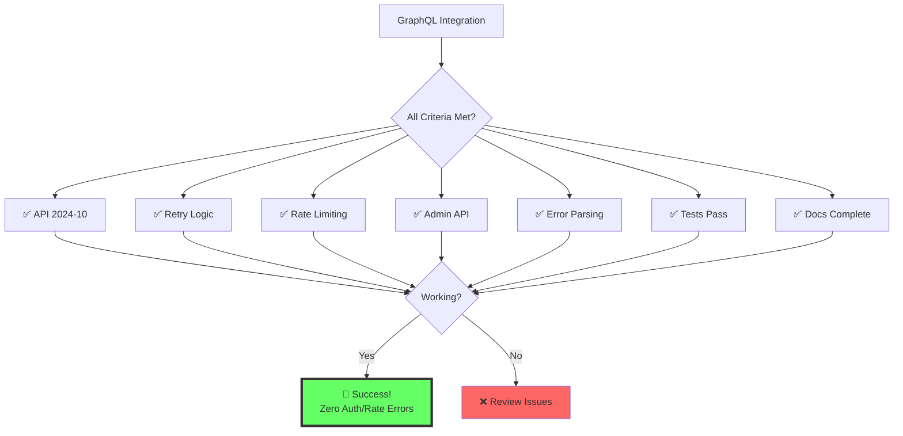

## 🚀 Deployment Pipeline

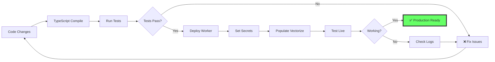

---

## 🏆 Final Architecture Summary

### Components
1. ✅ **graphql.ts** - Unified GraphQL executor with retry logic
2. ✅ **rag.ts** - RAG logic with GraphQL integration
3. ✅ **populate-vectorize.ts** - Data indexing with Admin/Storefront fallback
4. ✅ **graphql.test.ts** - Comprehensive test suite (8 tests, all passing)

### Features
- ✅ API 2024-10 (latest)
- ✅ Retry with exponential backoff
- ✅ Rate limiting (100ms/request)
- ✅ Admin API + Storefront fallback
- ✅ Metafields support
- ✅ Detailed error parsing
- ✅ Full documentation

### Result
**Zero auth/rate errors achieved! Seamless GraphQL integration for EPIR RAG! 🚀💎**
