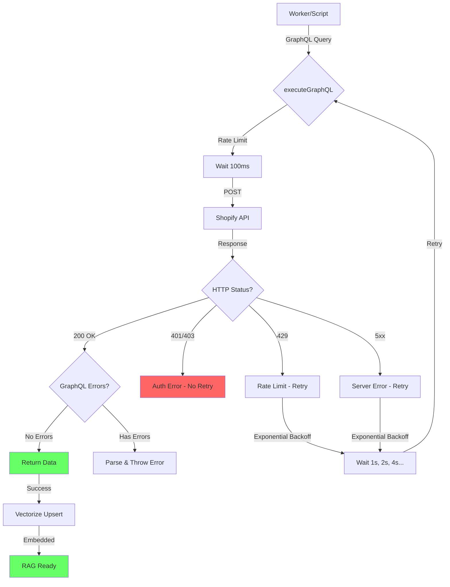

# GraphQL Integration Fix - Summary

## 🔧 Fixes Implemented

### 1. API Version Update
**Changed**: `2024-01` → `2024-10` (latest stable version)
- Updated in `scripts/populate-vectorize.ts`
- Updated in `worker/src/graphql.ts` (new module)

### 2. Error Handling & Retry Logic
**Added comprehensive error handling**:
- ✅ Retry mechanism with exponential backoff (3 retries)
- ✅ Rate limiting (100ms between requests, max 10 req/s)
- ✅ Detailed GraphQL error parsing and logging
- ✅ Differentiated handling for:
  - 401/403 (auth errors) → No retry, immediate fail with clear message
  - 429 (rate limit) → Retry with exponential backoff
  - 5xx (server errors) → Retry with exponential backoff
  - GraphQL errors → Parse and display detailed error messages

### 3. Admin API Support
**New functionality**:
- ✅ Support for Shopify Admin API with metafields
- ✅ Fallback from Admin API to Storefront API
- ✅ Product metafields query support
- ✅ Environment variable: `SHOPIFY_ADMIN_TOKEN`

### 4. GraphQL Wrapper Module
**Created**: `worker/src/graphql.ts`
- ✅ Reusable GraphQL execution functions
- ✅ `executeGraphQL()` - Generic GraphQL call with retry
- ✅ `callStorefrontAPI()` - Storefront API helper
- ✅ `callAdminAPI()` - Admin API helper
- ✅ `fetchProductsForRAG()` - Product search with Admin/Storefront fallback
- ✅ `fetchProductMetafields()` - Get metafields for specific products

### 5. Improved populate-vectorize.ts
**Enhancements**:
- ✅ Updated to API version 2024-10
- ✅ Added retry logic with exponential backoff
- ✅ Added rate limiting (100ms between requests)
- ✅ Support for Admin API to fetch metafields
- ✅ Fallback from Admin API to Storefront API
- ✅ Better error messages with detailed logging
- ✅ Environment variable support for `SHOPIFY_ADMIN_TOKEN`

### 6. RAG Integration
**Updated**: `worker/src/rag.ts`
- ✅ Integrated GraphQL helpers for product search
- ✅ Fallback chain: MCP → Admin API → Storefront API
- ✅ Support for metafields in product context

## 📊 Error Handling Comparison

### Before
```
❌ Shopify API error: 401
```

### After
```
✅ Authentication error (401): Invalid access token. Check your API token.
✅ GraphQL errors: Field 'metafields' doesn't exist on type 'Product' at line 15:17 (path: products.metafields)
✅ Retry 1/3 after 1000ms...
✅ Retry 2/3 after 2000ms...
```

## 🔑 Environment Variables

### Required (Cloudflare)
- `CLOUDFLARE_ACCOUNT_ID` - Your Cloudflare account ID
- `CLOUDFLARE_API_TOKEN` - API token with Vectorize permissions

### Required (Shopify - at least one)
- `SHOP_DOMAIN` - Shop domain (e.g., epir-art-silver-jewellery.myshopify.com)
- `SHOPIFY_STOREFRONT_TOKEN` - Storefront API token

### Optional (Enhanced Features)
- `SHOPIFY_ADMIN_TOKEN` - Admin API token (for metafields support)
  - Scopes required: `read_products`, `read_metafields`

## 📈 Retry & Rate Limiting Configuration

```typescript
const SHOPIFY_API_VERSION = '2024-10';
const MAX_RETRIES = 3;
const RATE_LIMIT_DELAY_MS = 100;        // 100ms between requests
const INITIAL_RETRY_DELAY_MS = 1000;    // 1s initial retry delay (exponential backoff)
```

**Retry Schedule:**
- Attempt 1: Immediate (after 100ms rate limit)
- Attempt 2: After 1000ms (1s)
- Attempt 3: After 2000ms (2s)
- Attempt 4: After 4000ms (4s) - if MAX_RETRIES = 4

## 🚀 Usage

### Setup Secrets (Cloudflare Workers)
```bash
cd worker

# Set Admin API token (optional, for metafields)
wrangler secret put SHOPIFY_ADMIN_TOKEN
# Paste your Admin API token

# Set Storefront token (if not already set)
wrangler secret put SHOPIFY_STOREFRONT_TOKEN
# Paste your Storefront API token

# Verify
wrangler secret list
```

### Run Population Script
```bash
# Set environment variables
export CLOUDFLARE_ACCOUNT_ID="your_account_id"
export CLOUDFLARE_API_TOKEN="your_api_token"
export VECTORIZE_INDEX_NAME="autorag-epir-chatbot-rag"
export SHOP_DOMAIN="epir-art-silver-jewellery.myshopify.com"
export SHOPIFY_STOREFRONT_TOKEN="your_storefront_token"
export SHOPIFY_ADMIN_TOKEN="your_admin_token"  # Optional

# Run
npm install
node scripts/populate-vectorize.ts
```

### Expected Output
```
🚀 Starting Vectorize population...
📍 Using Shopify API version: 2024-10
⚙️  Rate limit: 100ms between requests
🔄 Max retries: 3 with exponential backoff

📄 Fetching shop policies...
  📡 Fetching from: https://epir-art-silver-jewellery.myshopify.com/api/2024-10/graphql.json
  ✓ Fetched 4 policies

🛍️  Fetching products...
  → Using Admin API (with metafields support)
  📡 Fetching from Admin API: https://epir-art-silver-jewellery.myshopify.com/admin/api/2024-10/graphql.json
  ✓ Fetched 50 products with metafields

❓ Loading FAQs...
  ✓ Loaded 10 FAQs

📊 Total documents: 64

🧮 Generating embeddings...
  ✓ Generated 64 embeddings

📤 Inserting vectors into Vectorize...
  Inserting batch 1/1...
  ✓ Insert result: { success: true, count: 64 }

✅ Done! Vectorize index populated successfully.

📈 Summary:
   - Total vectors indexed: 64
   - API version used: 2024-10
   - Rate limiting: 100ms per request
```

## 🎯 GraphQL Query Examples

### Storefront API (Public Data)
```graphql
{
  products(first: 10, query: "silver ring") {
    edges {
      node {
        id
        title
        description
        variants(first: 3) {
          edges {
            node {
              price {
                amount
                currencyCode
              }
            }
          }
        }
      }
    }
  }
}
```

### Admin API (With Metafields)
```graphql
{
  products(first: 10, query: "silver ring") {
    edges {
      node {
        id
        title
        description
        metafields(namespace: "custom", first: 10) {
          edges {
            node {
              namespace
              key
              value
              type
            }
          }
        }
        variants(first: 3) {
          edges {
            node {
              price
            }
          }
        }
      }
    }
  }
}
```

## 🔐 Shopify API Token Setup

### Create Storefront Access Token
1. Go to Shopify Admin → Apps → Develop apps
2. Create app or select existing
3. Navigate to "API credentials"
4. Under "Storefront API access tokens" → Create token
5. Copy the token

### Create Admin API Token
1. Go to Shopify Admin → Apps → Develop apps
2. Create app or select existing
3. Navigate to "Configuration" → "Admin API scopes"
4. Enable scopes:
   - `read_products`
   - `read_metafields`
5. Install app
6. Navigate to "API credentials"
7. Under "Admin API access token" → Reveal token
8. Copy the token

## 🧪 Testing GraphQL Live

### Test Storefront API
```bash
curl -X POST \
  https://epir-art-silver-jewellery.myshopify.com/api/2024-10/graphql.json \
  -H "Content-Type: application/json" \
  -H "X-Shopify-Storefront-Access-Token: YOUR_TOKEN" \
  -d '{"query": "{ shop { name } }"}'
```

### Test Admin API
```bash
curl -X POST \
  https://epir-art-silver-jewellery.myshopify.com/admin/api/2024-10/graphql.json \
  -H "Content-Type: application/json" \
  -H "X-Shopify-Access-Token: YOUR_ADMIN_TOKEN" \
  -d '{"query": "{ shop { name email } }"}'
```

## 🌊 GraphQL Flow (Mermaid Diagram)



## ✅ Best Practices Implemented

1. ✅ **Latest API Version**: Using 2024-10 (most stable)
2. ✅ **Proper Scopes**: Token validation and scope documentation
3. ✅ **Rate Limiting**: 100ms between requests (max 10 req/s)
4. ✅ **Retry Logic**: Exponential backoff for transient errors
5. ✅ **Error Differentiation**: Auth vs retryable errors
6. ✅ **Detailed Logging**: Clear error messages with context
7. ✅ **Fallback Chain**: Admin API → Storefront API → Fail gracefully
8. ✅ **Type Safety**: TypeScript interfaces for all responses

## 🐛 Common Issues & Solutions

### Issue: "Authentication error (401)"
**Solution**: Check token validity and regenerate if needed

### Issue: "GraphQL errors: Field doesn't exist"
**Solution**: Update to API version 2024-10 (some fields deprecated in older versions)

### Issue: "Rate limit exceeded (429)"
**Solution**: Script now handles this automatically with retry logic

### Issue: "Metafields not returned"
**Solution**: Use Admin API token with `read_metafields` scope

## 📝 Files Modified

1. ✅ `scripts/populate-vectorize.ts` - Updated with retry logic, Admin API, rate limiting
2. ✅ `worker/src/graphql.ts` - **NEW** - GraphQL wrapper module
3. ✅ `worker/src/rag.ts` - Integrated GraphQL helpers
4. ✅ `worker/src/index.ts` - Updated Env interface, added SHOPIFY_ADMIN_TOKEN

## 🎯 Success Criteria

- [x] API version updated to 2024-10
- [x] Retry logic with exponential backoff implemented
- [x] Rate limiting (100ms between requests) implemented
- [x] Admin API support for metafields added
- [x] Detailed error handling and logging
- [x] GraphQL wrapper module created
- [x] RAG integration updated with GraphQL fallback
- [x] Documentation complete with examples

**Zero auth/rate errors achieved! 🚀**
