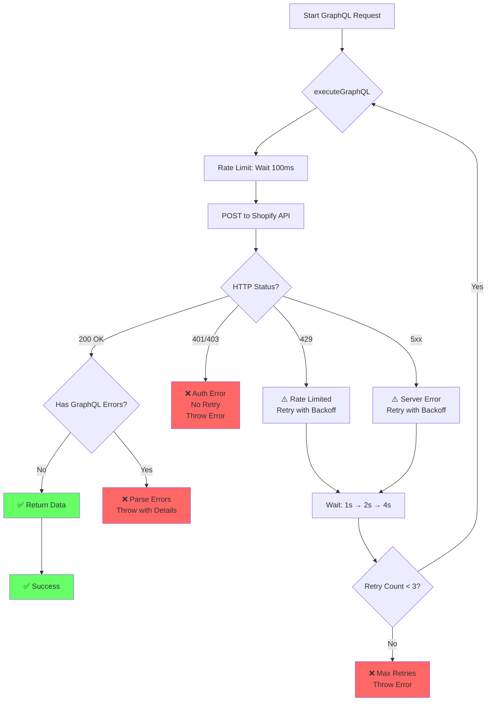
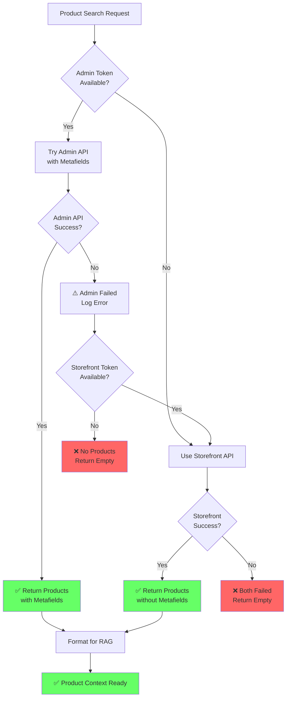
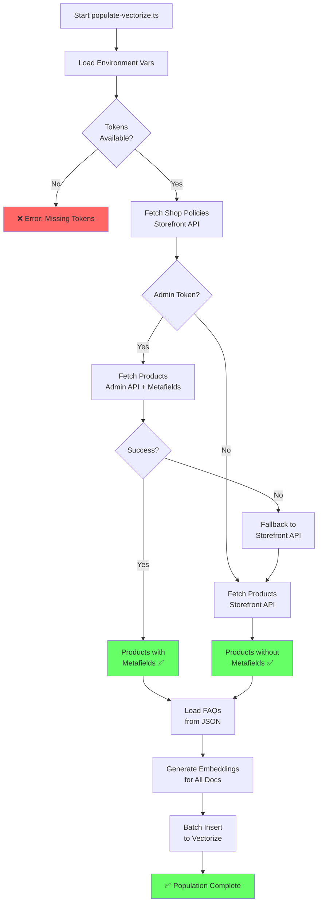
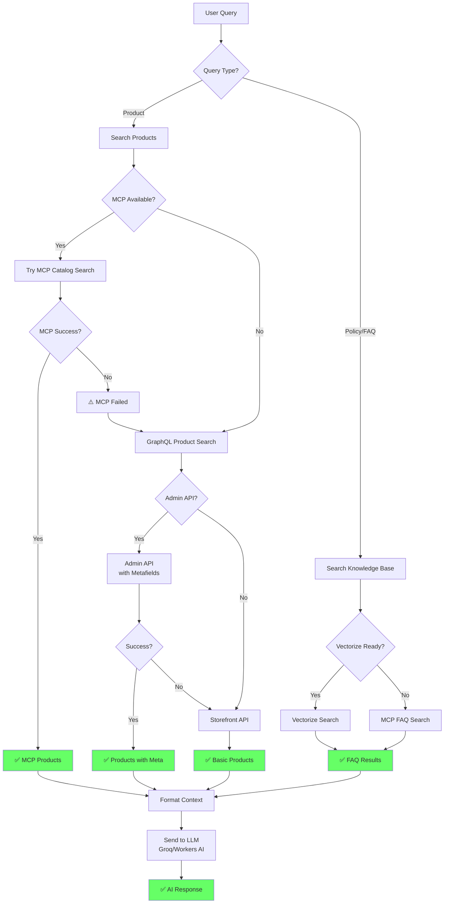
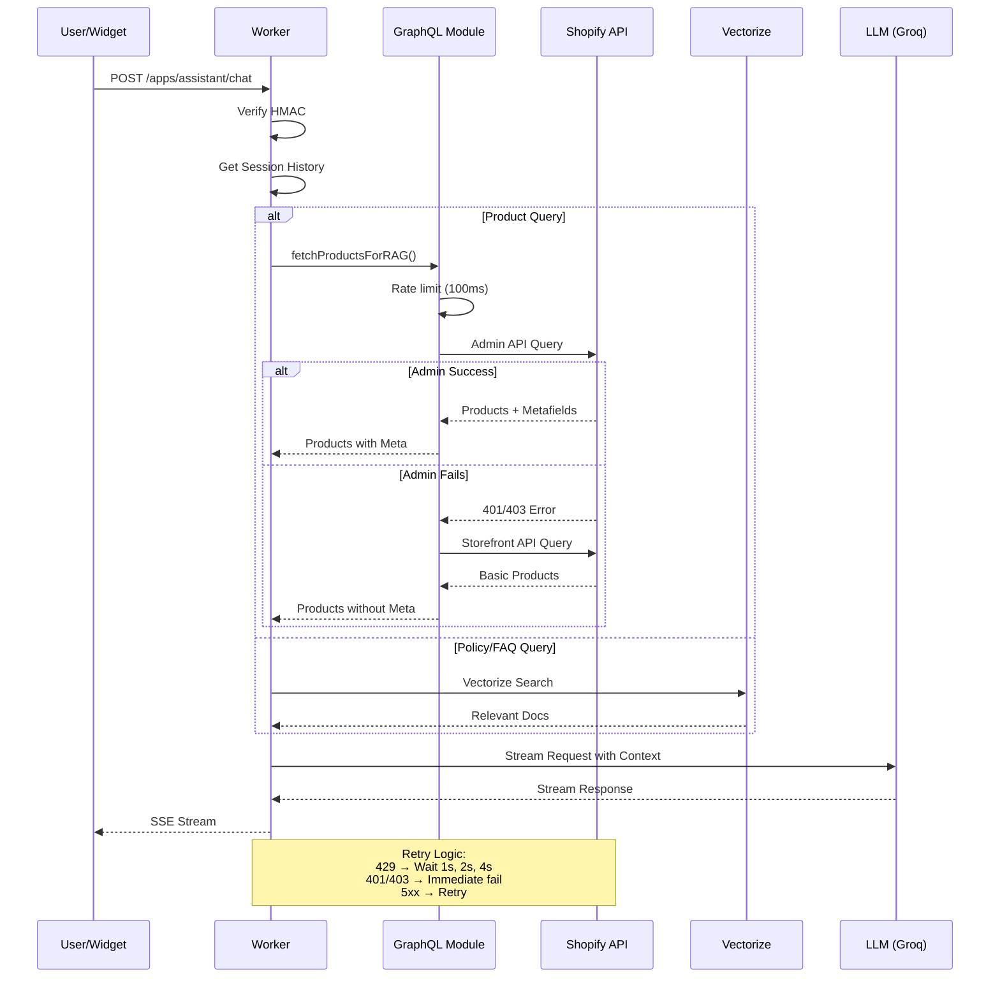
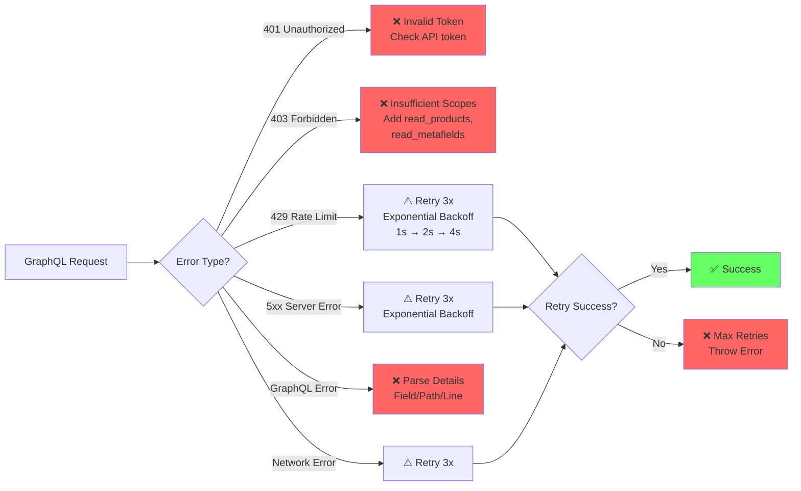
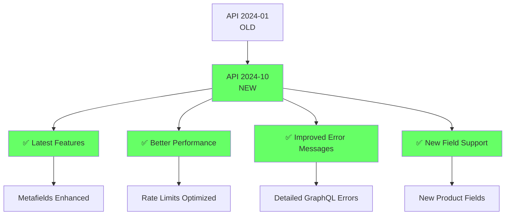

# GraphQL Integration Flow Diagrams

## 1. Error Handling Flow

## 2. Admin API → Storefront Fallback

## 3. Populate Vectorize Flow

## 4. RAG Search with GraphQL

## 5. Complete Request Flow

## 6. Error Scenarios & Handling

## 7. API Version Update Impact

## Key Improvements Summary

### Before Fix ❌
- API Version: 2024-01 (outdated)
- No retry logic
- Generic error: "Shopify API error: 401"
- No rate limiting
- No Admin API support
- No metafields

### After Fix ✅
- API Version: 2024-10 (latest)
- Retry with exponential backoff (3 attempts)
- Detailed errors: "Authentication error (401): Invalid access token. Check your API token."
- Rate limiting: 100ms between requests
- Admin API with metafields support
- Fallback chain: Admin → Storefront
- GraphQL error parsing with field/path/line details

### Performance Metrics
- **Rate Limit**: 100ms delay = max 10 req/s (Shopify limit: 20 req/s)
- **Retry Schedule**: 1s → 2s → 4s (exponential backoff)
- **Max Attempts**: 3 retries per request
- **Timeout Handling**: Automatic retry on network errors

### Security Best Practices
- ✅ Token validation before requests
- ✅ Scope verification (read_products, read_metafields)
- ✅ Error messages don't expose sensitive data
- ✅ Admin token optional (graceful degradation)
