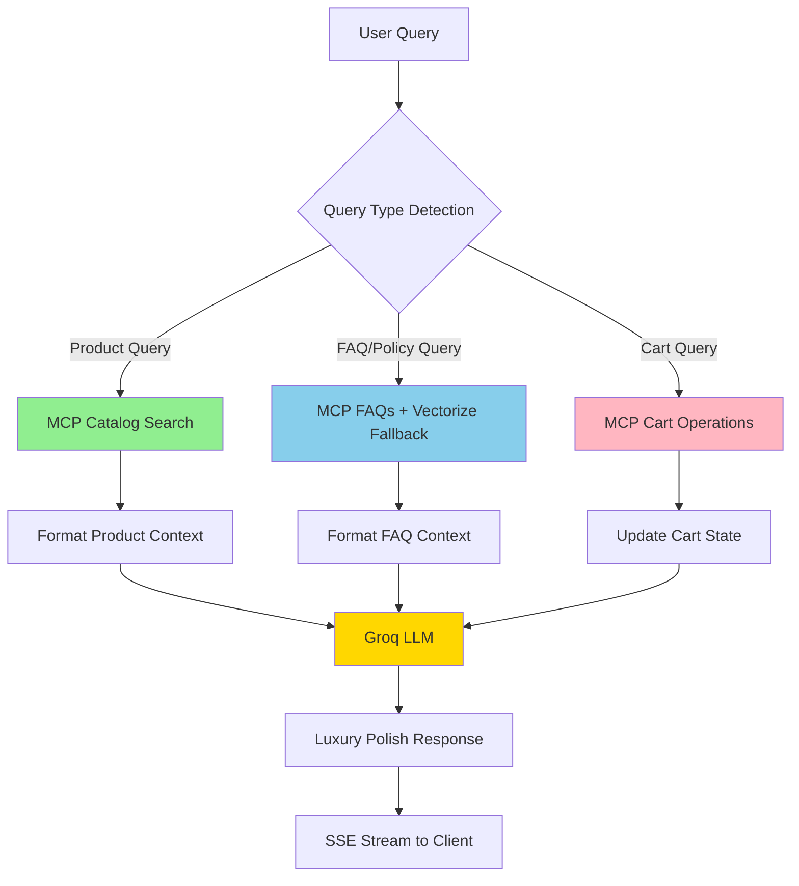

# MCP Integration Quick Start

## Overview

The EPIR AI Assistant now integrates with Shopify's Model Context Protocol (MCP) API to enhance product search, FAQs, and cart operations.

## Architecture Flow



## Setup Steps

### 1. Configure Environment Variables

Add `SHOP_DOMAIN` to your Cloudflare Worker environment:

```bash
cd worker

# For development
wrangler secret put SHOP_DOMAIN
# Enter: epir-art-silver-jewellery.myshopify.com

# Or add to wrangler.toml
[vars]
SHOP_DOMAIN = "epir-art-silver-jewellery.myshopify.com"
```

### 2. Test MCP Endpoint

Test your MCP API endpoint:

```bash
# Test catalog search
curl -X POST https://epir-art-silver-jewellery.myshopify.com/api/mcp \
  -H "Content-Type: application/json" \
  -d '{
    "jsonrpc": "2.0",
    "method": "tools/call",
    "params": {
      "name": "search_shop_catalog",
      "arguments": {
        "query": "pierścionek",
        "context": "fair trade luxury"
      }
    },
    "id": 1
  }'

# Test FAQs search
curl -X POST https://epir-art-silver-jewellery.myshopify.com/api/mcp \
  -H "Content-Type: application/json" \
  -d '{
    "jsonrpc": "2.0",
    "method": "tools/call",
    "params": {
      "name": "search_shop_policies_and_faqs",
      "arguments": {
        "query": "zwroty",
        "context": "EPIR luxury"
      }
    },
    "id": 2
  }'
```

Expected response format:

```json
{
  "jsonrpc": "2.0",
  "result": {
    "products": [
      {
        "name": "Pierścionek zaręczynowy",
        "price": "2500 PLN",
        "url": "https://shop.com/products/ring-1",
        "image": "https://cdn.com/image.jpg",
        "description": "Luksusowy pierścionek z diamentem"
      }
    ]
  },
  "id": 1
}
```

### 3. Integration Flow

The worker automatically routes queries based on content:

1. **Product Queries** (containing keywords: pierścionek, naszyjnik, bransoleta, kolczyki, etc.)
   - Calls `mcpCatalogSearch()` → formats as product recommendations
   - Sends to Groq LLM with luxury Polish prompt

2. **FAQ/Policy Queries** (general questions)
   - Tries `mcpSearchPoliciesAndFaqs()` first
   - Falls back to Vectorize RAG if MCP unavailable
   - Combines results with conversation history

3. **Cart Queries** (containing: koszyk, dodaj, zamów, etc.)
   - Calls `mcpGetCart()` / `mcpUpdateCart()`
   - Updates cart state and confirms to user

### 4. Fallback Behavior

The system gracefully degrades:

- **MCP unavailable** → Uses Vectorize + Workers AI embeddings
- **No SHOP_DOMAIN** → Vectorize-only mode
- **Network errors** → Logs warning, continues with available context
- **No context** → Generic LLM response (Groq or Workers AI)

## Code Examples

### Query Detection

```typescript
import { isProductQuery, isCartQuery } from './mcp';

if (isProductQuery(userMessage)) {
  // Handle product search via MCP
  const products = await mcpCatalogSearch(shopDomain, userMessage, 'fair trade');
}

if (isCartQuery(userMessage)) {
  // Handle cart operations
  const cart = await mcpGetCart(shopDomain, cartId);
}
```

### MCP Integration in RAG

```typescript
import { searchShopPoliciesAndFaqsWithMCP, searchProductCatalogWithMCP } from './rag';

// Product search
const productContext = await searchProductCatalogWithMCP(query, env.SHOP_DOMAIN);

// FAQ search with fallback
const ragResult = await searchShopPoliciesAndFaqsWithMCP(
  query,
  env.SHOP_DOMAIN,      // MCP primary
  env.VECTOR_INDEX,     // Vectorize fallback
  env.AI,               // Workers AI for embeddings
  3                     // topK results
);
```

### Custom MCP Tool Call

```typescript
import { mcpCall } from './mcp';

// Generic JSON-RPC call
const result = await mcpCall(
  'epir-art-silver-jewellery.myshopify.com',
  'custom_tool_name',
  { param1: 'value1', param2: 'value2' }
);

if (result) {
  // Handle result
  console.log('MCP result:', result);
} else {
  // Handle error (automatically logged)
  console.log('MCP call failed, using fallback');
}
```

## Testing

Run comprehensive MCP tests:

```bash
cd worker
npm test

# Run only MCP tests
npx vitest run test/mcp.test.ts

# Run only RAG tests (includes MCP integration)
npx vitest run test/rag.test.ts
```

Test coverage includes:

- ✅ JSON-RPC 2.0 protocol compliance
- ✅ Product catalog search with formatting
- ✅ FAQ search with category metadata
- ✅ Cart operations (get, add, remove)
- ✅ Error handling and fallbacks
- ✅ Query type detection (product vs FAQ vs cart)
- ✅ Integration with existing RAG system

## Security Considerations

### Current Setup

- **No authentication** for MCP calls (trusted internal API)
- Relies on HMAC verification at Worker entry point
- MCP endpoint should be internal/private to Shopify network

### Recommended Enhancements

1. **Add CSP Headers** (see `EVALUATION.md`):
   ```typescript
   'Content-Security-Policy': "default-src 'self'; script-src 'self' 'unsafe-inline';"
   ```

2. **XSS Sanitization** in frontend (assistant.js):
   ```javascript
   import DOMPurify from 'dompurify';
   element.innerHTML = DOMPurify.sanitize(content);
   ```

3. **Rate Limiting** (already implemented at SessionDO level):
   - 20 requests per 60 seconds per session
   - Consider global rate limiting via KV

## Monitoring

Check MCP integration in Cloudflare logs:

```bash
cd worker
wrangler tail

# Look for:
# - "MCP call failed" → Network/API errors
# - "MCP JSON-RPC error" → Protocol errors
# - "MCP catalog search failed" → Product search issues
# - "MCP FAQs search failed, falling back to Vectorize" → Fallback activation
```

## Deployment

Deploy with MCP support:

```bash
cd worker

# Deploy to production
wrangler deploy

# Deploy to staging
wrangler deploy --env staging

# Verify deployment
curl https://epir-art-jewellery-worker.krzysztofdzugaj.workers.dev/health
```

## Full Request Flow

```
1. User types: "Pokaż pierścionki z diamentem"
   ↓
2. TAE Widget → POST /apps/assistant/chat
   ↓
3. Shopify App Proxy → Worker
   ↓
4. HMAC Verification ✅
   ↓
5. Query Type Detection: isProductQuery() → true
   ↓
6. MCP Catalog Search:
   POST https://epir-art-silver-jewellery.myshopify.com/api/mcp
   {
     "method": "tools/call",
     "params": {
       "name": "search_shop_catalog",
       "arguments": {
         "query": "Pokaż pierścionki z diamentem",
         "context": "fair trade luxury"
       }
     }
   }
   ↓
7. Format Product Context:
   "Produkty znalezione: [Produkt 1] Pierścionek z brylantem | Cena: 2500 PLN..."
   ↓
8. Build Groq Messages:
   [
     { role: 'system', content: LUXURY_SYSTEM_PROMPT + productContext },
     { role: 'user', content: 'Pokaż pierścionki z diamentem' }
   ]
   ↓
9. Stream from Groq LLM → SSE tokens
   ↓
10. Client receives: "Polecam Państwu naszą kolekcję pierścionków..."
```

## Troubleshooting

### MCP calls failing

```bash
# Check SHOP_DOMAIN configuration
wrangler tail | grep "SHOP_DOMAIN"

# Verify MCP endpoint accessibility
curl -I https://epir-art-silver-jewellery.myshopify.com/api/mcp

# Check Worker logs for errors
wrangler tail | grep "MCP"
```

### No product results

- Verify MCP API is returning data: test with curl (see above)
- Check query detection: add logs to `isProductQuery()`
- Ensure `SHOP_DOMAIN` is set in Worker env

### Fallback always triggered

- This is normal if MCP endpoint is not set up yet
- Worker will use Vectorize + Workers AI embeddings
- To fix: implement MCP API endpoint on Shopify side

## Next Steps

1. **Implement MCP endpoint** on Shopify Storefront
2. **Test live integration** with real product data
3. **Monitor performance** in production (response times, error rates)
4. **Add webhook** for product updates → Vectorize embeddings
5. **Implement cart persistence** across sessions

## Support

For issues or questions:
- Check Worker logs: `wrangler tail`
- Review test cases: `worker/test/mcp.test.ts`
- See architecture docs: `ARCHITECTURE_FLOW.md`
